# &nbsp;<b> Hi, welcome To My GITHUB profile ♥ </b>

<!--  -->

<table>
  <tr>
  <td width="60%">
  ❤️&nbsp;I am a Full Stack AI Developer with 5+ years of experience delivering scalable web applications, AI-powered solutions, and cloud-native platforms. 😜

  With proven expertise in Full-stack development, Generative AI, and Agentic AI, I combine backend engineering, modern frontend development, LLMs, LangChain, RAG Pipelines, AI agent frameworks, and database design to bring ideas to production.

  🚀 I help startups, product teams, and businesses turn cutting-edge AI ideas into production-grade, scalable applications that deliver measurable business impact. 🌱
  </td>
  <td width="35%"></td>
</table>

<h1>👨🏻‍💻 My skill sets 😎</h1>

<table>
  <tr>
    <td></td>
    <td></td>
    <td></td>
    <td></td>
    <td></td>
    <td></td>
    <td></td>
    <td></td>
    <td></td>
    <td></td>
    <td></td>
    <td></td>
  </tr>
  <tr>
    <td></td>
    <td></td>
    <td></td>
    <td></td>
    <td></td>
    <td></td>
    <td></td>
    <td></td>
    <td></td>
    <td></td>
    <td></td>
    <td></td>
  </tr>
  <tr>
    <td></td>
    <td></td>
    <td></td>
    <td></td>
    <td></td>
    <td></td>
    <td></td>
    <td></td>
    <td></td>
    <td></td>
    <td></td>
    <td></td>
  </tr>
  <tr>
    <td></td>
    <td></td>
    <td></td>
    <td></td>
    <td></td>
    <td></td>
    <td></td>
    <td></td>
    <td></td>
    <td></td>
    <td></td>
    <td></td>
  </tr>
</table>

<h1>🏆 GitHub Trophies</h1>
  

  
<h4>𝐼 𝒷𝑒𝓁𝒾𝑒𝓋𝑒 𝒜𝐼 𝓈𝒽𝑜𝓊𝓁𝒹 𝓌𝑜𝓇𝓀 𝒻𝑜𝓇 𝒽𝓊𝓂𝒶𝓃𝓈 — 𝓃𝑜𝓉 𝓇𝑒𝓅𝓁𝒶𝒸𝑒 𝓉𝒽𝑒𝓂. 𝑀𝓎 𝓈𝓎𝓈𝓉𝑒𝓂𝓈 𝒶𝓊𝑔𝓂𝑒𝓃𝓉 𝓉𝑒𝒶𝓂𝓈, 𝓇𝑒𝒹𝓊𝒸𝑒 𝓉𝑜𝒾𝓁, 𝒶𝓃𝒹 𝓈𝒸𝒶𝓁𝑒 𝒾𝓃𝓉𝑒𝓁𝓁𝒾𝑔𝑒𝓃𝒸𝑒 — 𝓇𝑒𝓈𝓅𝑜𝓃𝓈𝒾𝒷𝓁𝓎.</h4>

